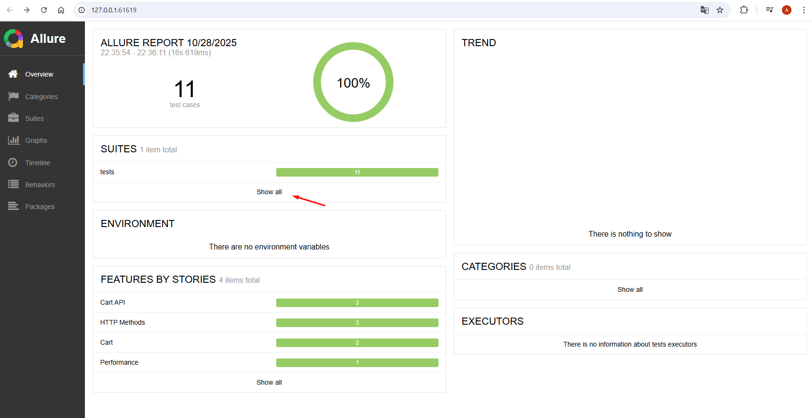
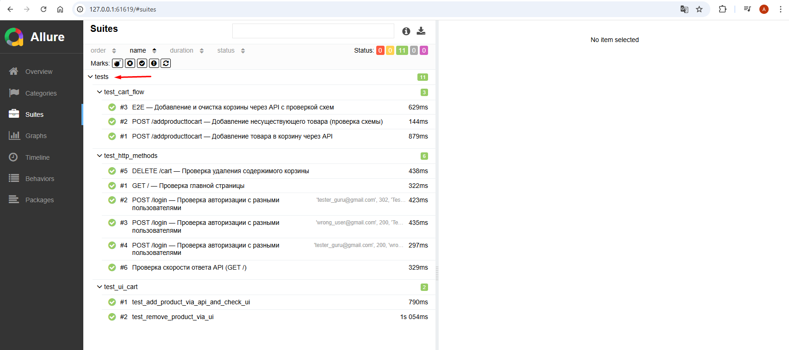

# 🎓 QA.GURU API Project

*Небольшой проект по автоматизации на основе сайта "https://demowebshop.tricentis.com", базовой проверке нескольких кейсов*
## О проекте

Этот проект является дипломной работой по курсу QA.GURU и представляет собой фреймворк для автоматизации тестирования API ["https://demowebshop.tricentis.com"](https://demowebshop.tricentis.com). В реализации использованы инструменты и библиотеки:

<p  align="center">
  
  
  
  
  
  
  
</p>

##  Запуск тестов локально

1) Клонировать репозиторий: git clone https://github.com/Altynnikov-N-V/qa_guru_api.git
2) Установить зависимости: pip install -r requirements.txt
3) Запуск тестов с генерацией отчетов Allure: allure serve tests/allure-results


##  Визуализация результатов (Allure Reports)


## Для просмотра результатов тестового запуска в Allure необходимо выполнить команду: 

```bash
allure serve reports/allure-results
```
<p></p>
<p></p>


